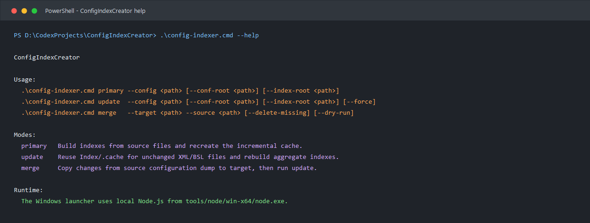
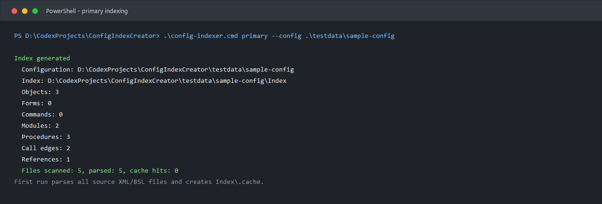
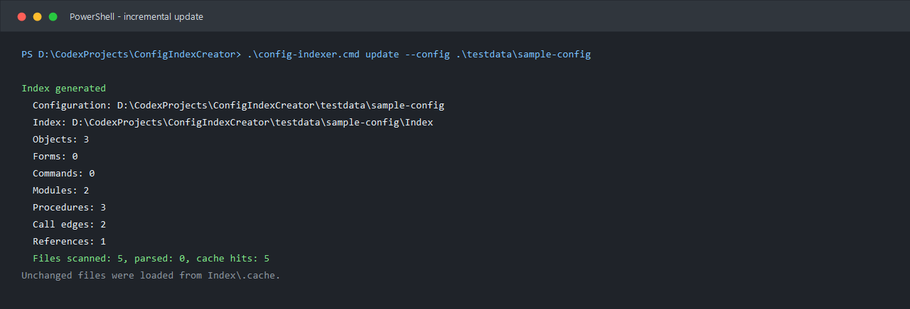
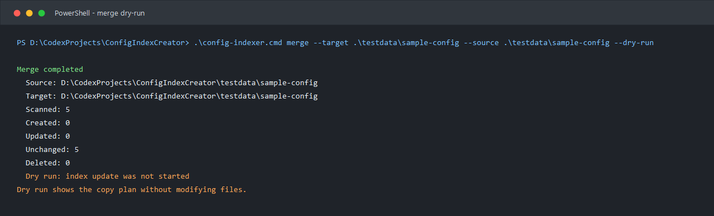
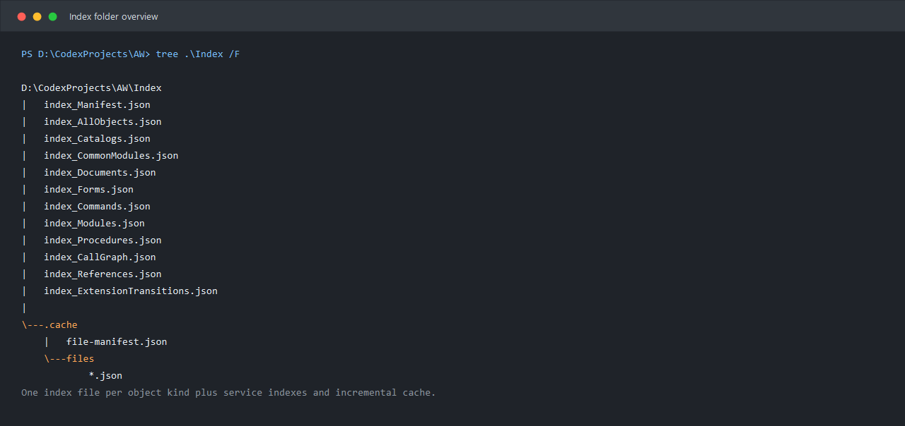

# ConfigIndexCreator

`ConfigIndexCreator` - консольная программа для индексации выгрузок конфигураций 1С в XML-файлах. Она строит отдельные JSON-индексы по видам объектов, граф связей объектов, список процедур и функций, а также статический граф вызовов BSL-кода.

Программа рассчитана на большие конфигурации, в том числе папки размером 8 ГБ и больше. Для повторного запуска используется инкрементальный кэш: неизмененные XML/BSL-файлы не парсятся заново.

## Быстрый Старт

Node.js искать в `PATH` не нужно: локальный рантайм уже лежит в проекте по пути `tools\node\win-x64\node.exe`. Основной запуск на Windows выполняется через `config-indexer.cmd`.
Windows-обвязка по умолчанию запускает Node.js с `--max-old-space-size=8192`. Если для очень большой конфигурации нужно больше или меньше памяти, задайте переменную окружения `CONFIG_INDEXER_MAX_OLD_SPACE_SIZE`.

Проверьте локальный Node.js:

```powershell
.\tools\node\win-x64\node.exe --version
```

Запустите первичную индексацию:

```powershell
.\config-indexer.cmd primary --config "D:\CodexProjects\AW"
```

После первого запуска обновляйте индексы так:

```powershell
.\config-indexer.cmd update --config "D:\CodexProjects\AW"
```

Чтобы перенести изменения из одной выгрузки конфигурации в другую и сразу обновить индексы целевой конфигурации:

```powershell
.\config-indexer.cmd merge --target "D:\CodexProjects\AW" --source "D:\CodexProjects\AL(ETRN)"
```

Если нужен PowerShell-скрипт, используйте `config-indexer.ps1`. На машинах со строгой Execution Policy его можно запустить так:

```powershell
powershell -ExecutionPolicy Bypass -File .\config-indexer.ps1 update --config "D:\CodexProjects\AW"
```

## Скриншоты

### Справка По Командам



### Первичная Индексация



### Обновление Индексов Из Кэша



### Проверка Объединения Без Изменений



### Файлы В Папке Index



## Что Делает Программа

`ConfigIndexCreator` обходит выгрузку конфигурации 1С, находит XML и BSL-файлы и формирует:

- реестр объектов метаданных;
- отдельные файлы индексов по типам объектов;
- список форм;
- список команд;
- список модулей;
- список процедур и функций;
- граф вызовов процедур и функций;
- ссылки между объектами метаданных;
- переходы расширений через аннотации `&Вместо`, `&Перед`, `&После`;
- служебный манифест с путями, статистикой и информацией о кэше.

Программа автоматически распознает типовые папки выгрузки:

- `AllConf`;
- `ALConf`;
- `Conf`;
- `Config`;
- `Configuration`;
- текущую папку, если в ней уже лежит `MainConf` или `Configuration.xml`.

## Основные Режимы

### `primary`

Первичная индексация. Используйте этот режим, когда индексов еще нет или нужно полностью пересобрать кэш.

```powershell
.\config-indexer.cmd primary --config "D:\CodexProjects\AW"
```

Что происходит:

- программа находит папку выгрузки конфигурации;
- парсит все XML и BSL-файлы;
- создает папку `Index`;
- записывает все `index_*.json`;
- создает кэш `Index\.cache`.

### `update`

Инкрементальное обновление индексов. Используйте этот режим после изменений в конфигурации.

```powershell
.\config-indexer.cmd update --config "D:\CodexProjects\AW"
```

Что происходит:

- программа сравнивает размер и время изменения файлов с манифестом кэша;
- неизмененные файлы берет из `Index\.cache`;
- новые и измененные файлы парсит заново;
- заново собирает итоговые агрегированные индексы.

Если нужно принудительно перепарсить все файлы:

```powershell
.\config-indexer.cmd update --config "D:\CodexProjects\AW" --force
```

### `merge`

Объединение выгрузок конфигураций. В этом режиме программа копирует изменения из конфигурации-источника в целевую конфигурацию, а затем запускает `update` для целевой папки.

```powershell
.\config-indexer.cmd merge --target "D:\CodexProjects\AW" --source "D:\CodexProjects\AL(ETRN)"
```

Где:

- `--target` - папка конфигурации, которую нужно обновить;
- `--source` - папка конфигурации, из которой нужно забрать изменения.

Перед реальным объединением рекомендуется выполнить сухой запуск:

```powershell
.\config-indexer.cmd merge --target "D:\CodexProjects\AW" --source "D:\CodexProjects\AL(ETRN)" --dry-run
```

По умолчанию `merge` не удаляет файлы из целевой конфигурации, если их нет в источнике. Если источник должен считаться полным зеркалом целевой конфигурации, добавьте:

```powershell
--delete-missing
```

## Параметры Командной Строки

| Параметр | Для режимов | Описание |
| --- | --- | --- |
| `--config <path>` | `primary`, `update` | Корневая папка проекта конфигурации. Внутри нее программа ищет `AllConf`, `ALConf`, `MainConf` и другие типовые варианты. |
| `--conf-root <path>` | `primary`, `update` | Явно задает папку выгрузки относительно `--config`, например `AllConf`. |
| `--index-root <path>` | все | Папка для индексов. По умолчанию `<config>\Index`. |
| `--target <path>` | `merge` | Целевая конфигурация, которую нужно обновить. |
| `--source <path>` | `merge` | Конфигурация-источник, из которой берутся изменения. |
| `--target-conf-root <path>` | `merge` | Явная папка выгрузки внутри `--target`. |
| `--source-conf-root <path>` | `merge` | Явная папка выгрузки внутри `--source`. |
| `--delete-missing` | `merge` | Удаляет из цели файлы, которых нет в источнике. Используйте только для полного зеркалирования. |
| `--dry-run` | `merge` | Показывает, какие файлы будут созданы, обновлены или удалены, но ничего не меняет. |
| `--no-content-compare` | `merge` | Не сравнивает SHA-1 для файлов одинакового размера с разными датами изменения. |
| `--pretty` | все | Форматирует JSON с отступами. Удобно для просмотра, но файлы будут больше. |
| `--force` | `update` | Игнорирует кэш и парсит все файлы заново. |
| `--resume-cache` | `primary`, `update` | Использует существующий per-file кэш при восстановлении после прерванного запуска. Без файлового манифеста кэш считается непроверенным, поэтому включайте флаг только если файлы конфигурации не менялись после аварийного прохода. |
| `--progress-every <number>` | `primary`, `update`, `merge` | Интервал вывода прогресса по количеству просмотренных файлов. По умолчанию `5000`. |
| `--checkpoint-every <number>` | `primary`, `update` | Интервал записи `Index\.cache\file-manifest.partial.json`. По умолчанию совпадает с `--progress-every`. |
| `--help` | все | Показывает справку по CLI. |

## Структура Индексов

Все результаты записываются в папку `Index` в корне папки, переданной в `--config` или `--target`.

Пример:

```text
D:\CodexProjects\AW
  AllConf\
  Index\
    index_AllObjects.json
    index_Catalogs.json
    index_CommonModules.json
    index_Documents.json
    index_Forms.json
    index_Commands.json
    index_Modules.json
    index_Procedures.json
    index_CallGraph.json
    index_References.json
    index_ExtensionTransitions.json
    index_Manifest.json
    .cache\
```

Назначение основных файлов:

| Файл | Назначение |
| --- | --- |
| `index_Manifest.json` | Главный манифест: время генерации, корневые пути, найденные источники, статистика, список файлов индекса. |
| `index_AllObjects.json` | Все найденные объекты метаданных. |
| `index_<ObjectType>.json` | Объекты конкретного вида, например `index_Catalogs.json`, `index_Documents.json`, `index_CommonModules.json`. |
| `index_Forms.json` | Формы, владельцы форм, обработчики событий и найденные ссылки. |
| `index_Commands.json` | Команды объектов и общие команды. |
| `index_Modules.json` | Модули BSL с владельцами, типами модулей и количеством процедур. |
| `index_Procedures.json` | Процедуры и функции с координатами в файлах. |
| `index_CallGraph.json` | Граф вызовов: откуда вызвали, какой метод вызван, куда удалось разрешить вызов. |
| `index_References.json` | Ссылки между объектами метаданных из XML, форм, команд и BSL. |
| `index_ExtensionTransitions.json` | Переходы расширений, найденные по аннотациям перехвата. |

## Кэш И Производительность

Кэш находится в:

```text
Index\.cache
```

Внутри хранится:

- `file-manifest.json` - состояние файлов на момент последнего индексирования;
- `files\*.json` - результат парсинга каждого отдельного XML/BSL-файла.

В режиме `update` программа не перечитывает полностью неизмененные файлы. Это особенно важно для крупных выгрузок, где полный обход может занимать много времени.

Для больших конфигураций рекомендуется:

- использовать обычный `update` после первого `primary`;
- если первый `primary` был прерван после записи `Index\.cache`, перезапустить его с `--resume-cache`;
- не включать `--pretty` на постоянной основе, если индексы нужны машине, а не человеку;
- хранить `Index` рядом с конфигурацией, чтобы не путать кэши разных выгрузок;
- запускать `merge --dry-run` перед реальным объединением;
- использовать `--delete-missing` только осознанно.

Во время долгого прохода индексатор пишет частичный файловый манифест `Index\.cache\file-manifest.partial.json`. Если процесс будет остановлен до создания `index_Manifest.json`, следующий запуск с `--resume-cache` сможет использовать уже готовые per-file кэши и продолжить работу без полного повторного парсинга.

## Практические Сценарии

### Первый Запуск Для Проекта AW

```powershell
.\config-indexer.cmd primary --config "D:\CodexProjects\AW"
```

Результат появится в:

```text
D:\CodexProjects\AW\Index
```

### Повторное Обновление После Изменений

```powershell
.\config-indexer.cmd update --config "D:\CodexProjects\AW"
```

В выводе обратите внимание на строки:

```text
Files scanned: 50000, parsed: 137, cache hits: 49863
```

Чем больше `cache hits`, тем меньше файлов пришлось парсить заново.

### Явно Указать Папку Выгрузки

Если проект содержит несколько папок, укажите нужную выгрузку:

```powershell
.\config-indexer.cmd primary --config "D:\CodexProjects\AW" --conf-root "AllConf"
```

### Записать Индексы В Другую Папку

```powershell
.\config-indexer.cmd update --config "D:\CodexProjects\AW" --index-root "D:\Temp\AW-Index"
```

### Обновить AW Из AL(ETRN)

Сначала проверьте, что будет сделано:

```powershell
.\config-indexer.cmd merge --target "D:\CodexProjects\AW" --source "D:\CodexProjects\AL(ETRN)" --dry-run
```

Если результат ожидаемый, выполните реальное объединение:

```powershell
.\config-indexer.cmd merge --target "D:\CodexProjects\AW" --source "D:\CodexProjects\AL(ETRN)"
```

После копирования изменений программа сама запустит обновление индексов целевой конфигурации.

## Как Читать Граф Вызовов

`index_CallGraph.json` содержит массив `edges`. Каждая запись описывает один найденный вызов:

```json
{
  "fromProcedureId": "4118f17e612b5069843cfde9",
  "fromModuleId": "3bb7e6dc5ac1d19371fa8100",
  "line": 2,
  "callKind": "qualified",
  "raw": "ОбщийМодуль.СообщитьОТоваре",
  "resolved": true,
  "targets": [
    {
      "procedureId": "92a678a84faff9786f9a6bff",
      "name": "СообщитьОТоваре",
      "moduleKind": "CommonModule"
    }
  ]
}
```

Важные поля:

- `fromProcedureId` - процедура, из которой идет вызов;
- `fromModuleId` - модуль, где расположен вызов;
- `line` - строка вызова;
- `raw` - текст вызова;
- `resolved` - удалось ли статически определить цель;
- `targets` - список найденных целевых процедур.

## Диагностика

### Конфигурация Не Найдена

Проверьте, что путь в `--config`, `--target` или `--source` существует. Если выгрузка лежит во вложенной папке, используйте `--conf-root`.

Пример:

```powershell
.\config-indexer.cmd primary --config "D:\CodexProjects\AW" --conf-root "AllConf"
```

### Индексы Получились Слишком Большими

Не используйте `--pretty` для регулярных машинных запусков. Этот режим удобен для ручного чтения JSON, но увеличивает размер файлов.

### Нужно Полностью Пересобрать Все

Запустите:

```powershell
.\config-indexer.cmd primary --config "D:\CodexProjects\AW"
```

или:

```powershell
.\config-indexer.cmd update --config "D:\CodexProjects\AW" --force
```

### Нужно Понять, Что Сделает Merge

Используйте:

```powershell
.\config-indexer.cmd merge --target "D:\CodexProjects\AW" --source "D:\CodexProjects\AL(ETRN)" --dry-run
```

## Ограничения

Индексатор выполняет статический анализ. Он не запускает платформу 1С и не исполняет BSL-код. Поэтому динамические вызовы, сформированные через строки, сложную рефлексию или вычисляемые имена методов, могут быть отражены как ссылки или упоминания, но не всегда будут разрешены в точную цель графа вызовов.

Файловое объединение в режиме `merge` работает на уровне выгрузки конфигурации: измененные файлы из источника копируются в целевую папку. Перед объединением больших рабочих конфигураций используйте `--dry-run` и резервное копирование целевой папки.

